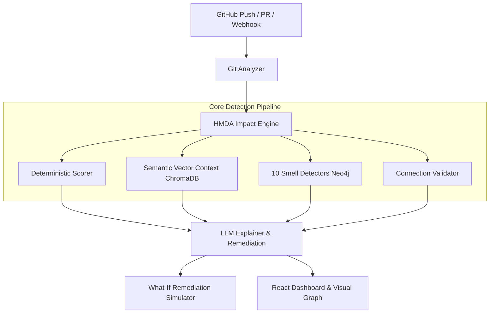

# Microservice Drift Tracker (MDT) — Architecture Documentation

## System Overview

Microservice Drift Tracker (MDT) is an automated architectural drift detection and cross-service impact analysis engine. It detects architectural decay, broken HTTP contracts, and breaking schema changes before pull requests reach production.



---

## 1. Hierarchical Microservice Drift Analysis (HMDA)

HMDA synthesizes deterministic factors, dependency graph traversal, and vector semantic context to evaluate risk on a normalized 0–100 scale:

1. **File Change Factor**: `min(30, file_count * 5)`
2. **API Alterations**: `+25 points` for endpoint or routing changes.
3. **Core Service Impact**: `+30 points` when core business entities (user, payment, orders) are modified.
4. **Dependency Depth**: `min(15, depth * 5)` extracted via Neo4j variable-length path traversal.
5. **Database Schema & DDL Modifications**: `+15 points` for migration scripts and schema definitions.
6. **Infrastructure & Deployment Config**: `+10 points` for Docker Compose, Helm, or Kubernetes config updates.
7. **Semantic Drift Modifier**: `0–10 points` computed via cosine similarity against historical change embeddings in ChromaDB.

---

## 2. The 10 Architectural Smell Detectors

MDT continuously evaluates the live Neo4j topology, OpenAPI contract snapshots, and dependency relationships against 10 distributed microservice anti-patterns:

### 1. Circular Dependency (`CRITICAL`)
- **Detection Algorithm:** APOC / Cypher variable-length path traversal detecting cyclic paths:
  ```cypher
  MATCH path = (s:Service)-[:DEPENDS_ON*2..8]->(s)
  WITH [node IN nodes(path) | node.name] AS cycle
  RETURN DISTINCT cycle
  ```
- **Threshold:** Any cycle of length 2 to 8.
- **Architectural Impact:** Causes synchronous request deadlocks, cascading timeout storms, and tight deployment coupling.
- **Remediation:** Introduce asynchronous messaging (event broker), decoupled pub/sub queues, or extract common shared interfaces.

### 2. God / Bottleneck Service (`HIGH`)
- **Detection Algorithm:** Graph in-degree and total degree evaluation:
  ```cypher
  MATCH (s:Service)
  OPTIONAL MATCH (caller:Service)-[:DEPENDS_ON]->(s)
  WITH s, count(caller) AS in_degree
  WHERE in_degree >= 3
  RETURN s.name, in_degree
  ```
- **Threshold:** Inbound degree $\ge 3$ callers or total degree $\ge 5$ (exempts API gateways and facades).
- **Architectural Impact:** Acts as a single point of failure (SPOF) and scaling bottleneck; failure propagates across multiple business domains.
- **Remediation:** Decompose service responsibilities, introduce load-balancing API facades, or cache read paths.

### 3. High Coupling (`MEDIUM`)
- **Detection Algorithm:** Outbound direct dependency count:
  ```cypher
  MATCH (s:Service)-[r:DEPENDS_ON]->(target:Service)
  WITH s, count(target) AS out_degree
  WHERE out_degree >= 4
  RETURN s.name, out_degree
  ```
- **Threshold:** Outbound direct dependencies $\ge 4$.
- **Architectural Impact:** Violates loose coupling; changes in any downstream service require coordination and risk breaking the caller.
- **Remediation:** Apply the Gateway Aggregator or Facade pattern to consolidate downstream interactions.

### 4. Dead / Isolated Service (`LOW`)
- **Detection Algorithm:** Isolated vertex search in the active dependency graph:
  ```cypher
  MATCH (s:Service)
  WHERE NOT (s)-[:DEPENDS_ON]-()
  RETURN s.name
  ```
- **Threshold:** Total degree $= 0$ (0 inbound and 0 outbound edges) in an ecosystem with $\ge 2$ registered services.
- **Architectural Impact:** Unused compute resource overhead, forgotten dead code, or incomplete integration into the service mesh.
- **Remediation:** Decommission abandoned microservice or wire missing HTTP/event routes into the gateway.

### 5. Dependency Explosion (`HIGH`)
- **Detection Algorithm:** Comparative snapshot diff of outgoing dependencies across commits:
  ```cypher
  MATCH (s:Service)-[:DEPENDS_ON*5..]->(downstream:Service)
  RETURN DISTINCT s.name, count(downstream)
  ```
- **Threshold:** $\ge 3$ new dependencies added in a single commit, or transitive dependency depth $\ge 5$.
- **Architectural Impact:** Exponential expansion of blast radius, latency amplification, and combinatorial failure modes.
- **Remediation:** Introduce event-driven choreography to flatten deep synchronous call trees.

### 6. API Instability (`HIGH` / `MEDIUM`)
- **Detection Algorithm:** OpenAPI snapshot endpoint diff engine:
  - Fetches and hashes `/openapi.json` across consecutive service revisions.
  - Computes set differences: $\Delta_{\text{removed}} = \text{Endpoints}_{t-1} \setminus \text{Endpoints}_t$ and $\Delta_{\text{churn}} = |\Delta_{\text{added}}| + |\Delta_{\text{removed}}|$.
- **Threshold:** Any removed endpoint triggers `HIGH` severity; $\ge 3$ modified/added endpoints triggers `MEDIUM` severity.
- **Architectural Impact:** Breaking contract changes silently disrupt downstream microservices and frontends without semantic versioning.
- **Remediation:** Maintain backward-compatible route aliases, version endpoints (e.g. `/v1/` to `/v2/`), or issue deprecation headers.

### 7. Shared Database (`HIGH`)
- **Detection Algorithm:** Multi-caller inspection on shared datastore targets:
  - Discovers database connections via port inspection (`5432` PostgreSQL, `3306` MySQL, `27017` MongoDB, `6379` Redis) or service naming keywords (`*db*`, `*postgres*`, `*mysql*`, `*mongo*`).
  - Flags when $\ge 2$ distinct microservices connect directly to the identical database instance.
- **Threshold:** Multiple services targeting the same database.
- **Architectural Impact:** Breaks microservice data encapsulation; schema changes by one service immediately crash other services; circumvents domain logic.
- **Remediation:** Enforce Database-per-Service pattern; expose datastore access through private domain API endpoints or domain events.

### 8. Chatty Communication (`MEDIUM`)
- **Detection Algorithm:** Mutual bidirectional edge checks and high connection density:
  - Checks if $(A \rightarrow B) \land (B \rightarrow A)$ in active dependencies.
  - Or counts distinct endpoint dependencies between the pair: $\text{count}(A \leftrightarrow B) \ge 3$.
- **Threshold:** Bidirectional cycles or $\ge 3$ distinct connections between a single pair of services.
- **Architectural Impact:** Inefficient ping-pong network chatter, elevated serialization costs, and tight temporal runtime coupling.
- **Remediation:** Consolidate fine-grained endpoints into coarse-grained batch APIs or adopt GraphQL / gRPC streaming.

### 9. Missing Circuit Breaker (`MEDIUM`)
- **Detection Algorithm:** Outbound fan-out analysis without resilience abstractions:
  - Outbound synchronous target count $\ge 3$.
  - Excludes services tagged as gateways, facades, or event brokers.
- **Threshold:** $\ge 3$ synchronous downstream targets without resilience patterns.
- **Architectural Impact:** Downstream latency spikes or failures exhaust caller thread pools and HTTP sockets, causing cascading brownouts.
- **Remediation:** Implement circuit breakers (e.g. Resilience4j, Polly, Hystrix pattern), exponential backoff retries, and fallback responses.

### 10. Hub-and-Spoke Centralization (`HIGH`)
- **Detection Algorithm:** Architectural degree centrality analysis:
  - Calculates degree ratio: $\text{Ratio} = \frac{\text{Neighbors}(s)}{\text{Total Services} - 1}$.
  - Excludes API gateways and facades.
- **Threshold:** Service directly connected to $\ge 60\%$ of all registered services in an ecosystem with $\ge 3$ microservices.
- **Architectural Impact:** Creates a distributed monolith where the central hub prevents team autonomy, blocks independent deployment, and creates an existential failure point.
- **Remediation:** Decentralize business logic into bounded contexts using domain-driven event streaming.

---

## 3. Resilient Multi-Manifest Architecture Ingestion

MDT automatically discovers and registers microservices from arbitrary GitHub repositories:
1. **Multi-Manifest Parsers**:
   - `docker-compose.yml` / `docker-compose.yaml`: Services, ports, environment variables, `depends_on`.
   - `render.yaml` / `render.yml`: Web services, root directories, runtime languages, and exposed ports.
   - Polyglot Monorepo Directories: Automatic discovery of `backend/`, `frontend/`, `services/*`, `apps/*`, `packages/*`, and single-service codebases.
2. **GitHub API Rate-Limit Immunity**:
   - Primary: GitHub REST API via App installation token or PAT.
   - Resilient Fallback: Automatically shallow-clones (`git clone --depth 1`) using GitPython and extracts file trees via `git ls-files` without token consumption.
3. **Static Route Discovery & Baseline Scoring**:
   - Static regex/AST inspection extracts routes (FastAPI, Express, Flask, Next.js) from entrypoints (`main.py`, `app.py`, `page.tsx`).
   - Automatically computes baseline architectural risk scores and logs initial assessments into history upon import.

---

## 4. Git Reference Resolution & Commit Patch Diffing

- **`resolve_commit_sha`**:
  - Translates branch references (`main`, `master`, tags, `HEAD`) into concrete 40-character commit hashes.
  - Leverages `git ls-remote <repo_url> <ref>` in an async threadpool for sub-second (<1.5s) resolution without API rate limits.
  - Secondary fallback to GitHub `.patch` headers (`From <40-char-sha> ...`).
- **Commit Patch Analysis**:
  - Fetches commit diffs and parses file modifications, additions, and deletions.
  - Automatically filters supported extensions and extracts AST structural signatures.

---

## 5. Polyglot Connection Validator

MDT inspects source code across 8 programming languages to ensure HTTP/REST call compatibility:
- **Languages**: Python (FastAPI/Flask), TypeScript/Node (Express), Java (Spring Boot), Go (Gin/net-http), Ruby (Rails), PHP (Laravel), C# (ASP.NET Core), Rust (Actix/Axum), Kotlin (Ktor).
- **Checks**:
  - `[UNRESOLVED_SERVICE_HOST]`: Hardcoded `localhost` inside container networks or unresolvable internal hostnames.
  - `[PORT_MISMATCH]`: Request port does not match listening port in registered target service.
  - `[ENDPOINT_MISMATCH]`: HTTP path does not exist on the target service's OpenAPI specification.

---

## 6. What-If Remediation Simulator

MDT provides a transactional sandbox to simulate architectural refactorings without modifying production:
1. Executes candidate graph mutations (`add_node`, `add_edge`, `remove_edge`) inside an open Neo4j transaction.
2. Measures pre-fix smell counts and risk score.
3. Applies architectural repairs (e.g. inserting resilience facades or breaking dependency cycles).
4. Re-evaluates smell counts and calculates the exact delta reduction.
5. Unconditionally executes `tx.rollback()`, ensuring live graph immutability.

---

## 7. Authentication, Security & Observability

- **JWT Authentication (`core/auth.py`, `api/auth.py`)**:
  - HS256 JWT tokens with configurable TTL (default 24h).
  - Passwords hashed with `bcrypt`.
  - Role-Based Access Control (`admin`, `engineer`).
  - Protected mutation routes (`/api/registry/import`, `/analysis/analyze`, `/analysis/preview-fix`).
- **Distributed Request Tracing & Observability (`core/middleware.py`)**:
  - `RequestTracingMiddleware` assigns a unique `X-Request-ID` (UUID4) to each HTTP transaction.
  - Computes sub-millisecond execution latency returned via `X-Response-Time-MS`.
  - Structured JSON logging (`JSONLogFormatter`) for distributed log aggregation.
  - Deep health diagnostics via `GET /health/detailed` verifying Neo4j, ChromaDB, LLM, and GitHub tokens.
